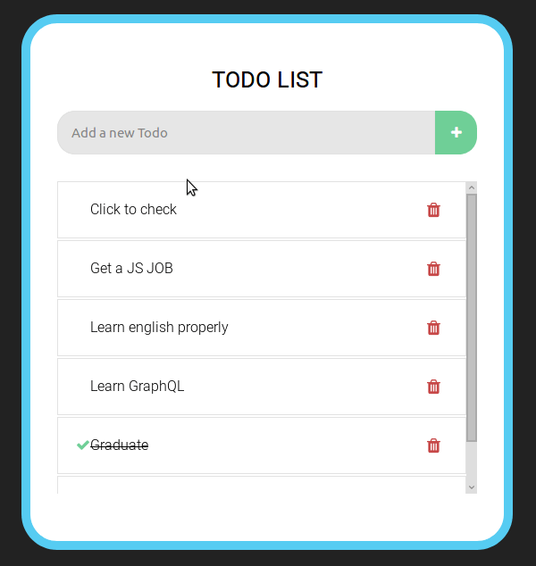

# todo app with tests

a simple react app to study about React, Redux and tests with Jest

#### install: 
Clone the repository and install the dependencies with npm using the command `npm install` or using yarn `yarn install`

#### Run: 
you can run the app with the command `npm start` or `yarn start` and open the url `localhost:3000` on your browser

#### Test:
to run tests use the command `npm test` or `yarn test` to see the test coverage include `--coverage` in the end of the command

created with create-react-app